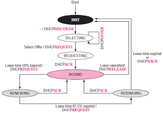

# Lecture 02: ARP & DHCP

---

## ARP (Address Resolution Protocol)

### Why ARP exists

IP routes by **layer‑3 (logical) addresses**, but Ethernet/Wi‑Fi deliver frames by **layer‑2 (MAC) addresses**. ARP bridges that gap on a local link: **IPv4 → MAC** mapping so an IP packet (EtherType `0x0800`) can be wrapped in an Ethernet frame. ARP itself is carried with EtherType `0x0806`.

### How ARP works (normal flow)

1. **Lookup cache** (ARP table). If miss:
2. **Broadcast ARP Request**: “Who has IP X.X.X.X? Tell me.”
3. **Unicast ARP Reply** from owner: “IP X.X.X.X is at aa:bb:cc:dd:ee:ff.”
4. **Cache** the mapping. Then send the Ethernet frame to that MAC.

### ARP packet format (Ethernet/IPv4), fixed 28 bytes

Bits start at **0** from the **first ARP byte** (after the Ethernet header). Byte indices are **inclusive**.

| Bytes | Bits (start–end) | Field | Size (bits) | Function |
| --- | --- | --- | --- | --- |
| 0–1 | 0–15 | **HTYPE** | 16 | Hardware type (**1 = Ethernet**). |
| 2–3 | 16–31 | **PTYPE** | 16 | Protocol type (**0x0800 = IPv4**). |
| 4 | 32–39 | **HLEN** | 8 | Hardware address length (**6 for MAC**). |
| 5 | 40–47 | **PLEN** | 8 | Protocol address length (**4 for IPv4**). |
| 6–7 | 48–63 | **OPER** | 16 | Opcode (**1=Request, 2=Reply**). |
| 8–13 | 64–111 | **SHA** | 48 | Sender Hardware Addr (MAC). |
| 14–17 | 112–143 | **SPA** | 32 | Sender Protocol Addr (IPv4). |
| 18–23 | 144–191 | **THA** | 48 | Target Hardware Addr (MAC). |
| 24–27 | 192–223 | **TPA** | 32 | Target Protocol Addr (IPv4). |

> For Ethernet/IPv4, HLEN=6, PLEN=4, giving the classic 28‑byte payload.
> 

### Variants & special cases

- **Proxy ARP**: A router answers ARP on behalf of a host not directly on the LAN, making it appear on‑link (legacy/VPN/dial‑in scenarios).
- **Gratuitous ARP (GARP)**: A host ARPs **for its own IP** (request or unsolicited reply). Uses:
    - Detect **duplicate IP** (IPv4 DAD‑style check).
    - **Refresh neighbors’ caches** after MAC change or HA failover/VM migration.
- **ARP Probe vs GARP**: Some OSes probe with `SPA=0.0.0.0` before using an address; GARP usually announces with `SPA=TPA=own IP`.

### Vulnerabilities & ARP poisoning

- ARP has **no authentication** → forged replies can **poison caches** for **MITM/DoS**.
- **Mitigations**: **DHCP snooping** + **Dynamic ARP Inspection (DAI)** on switches, **port/VLAN segmentation**, host firewalls, and **end‑to‑end crypto** (TLS/IPsec). Static ARP exists but is hard to operate at scale.

---

## DHCP (Dynamic Host Configuration Protocol)

### What DHCP does (typical configuration parameters)

Automatically supplies host network parameters. Common values include:

- **IP address** (leased) & **subnet mask**
- **Default gateway** (router list)
- **DNS servers**, **domain name** / search suffix
- **Lease time**, **T1 (Renew)**, **T2 (Rebind)**
- Optional: **NTP servers**, **MTU**, **WPAD** (option 252), **WINS/NetBIOS** (44/46/47), **PXE/boot** (66/67), **classless static routes** (121), **vendor‑specific** (43), **FQDN** (81), etc.

### DHCP allocation modes

- **Manual (a.k.a. Static)**: Admin binds a client (e.g., by MAC) to a **fixed IP** in the DHCP database.
- **Automatic**: Server **permanently assigns** an IP from a pool to the client.
- **Dynamic**: Server **leases** an IP for a time; address can be reclaimed/reused later (most common).

### How DHCP works (DORA, UDP/67↔68)

1. **Discover** (client → broadcast 255.255.255.255, src 68 → dst 67)
2. **Offer** (server → proposed IP + options)
3. **Request** (client → selects/asks for one)
4. **Ack** (server → confirms lease + options)

**Edge paths (less common control messages):**

- **NAK**:
    
    Server rejects the request (e.g., invalid/expired lease, wrong network, or policy). Client falls back to **DISCOVER**.
    
- **DECLINE**:
    
    Client reports that the **offered IP is already in use** (detected via **ARP Probe**/conflict check). Server marks it unusable and offers another.
    
- **RELEASE:**
    
    Client voluntarily gives up its lease early (shutdown/move). Server **returns the IP** to the pool immediately.
    
- **INFORM**:
    
    Client asks for **configuration options only** (no address assignment) because it already has an IP (e.g., static or PPP).
    

### Lease lifecycle & timers

- Server provides **lease time**. Client derives **T1** (~50%) and **T2** (~87.5%).
- **T1**: **renew** with original server (unicast).
- **T2**: **rebind** by broadcasting (any server can respond).
- On **expiry**: client must stop using the IP; OS often falls back to **link‑local 169.254/16** until service returns.

### DHCP through a relay agent

- You **do not** need one server per subnet. A **DHCP Relay Agent** (on router/switch SVI) forwards client broadcasts as **unicast** to the server, setting **GIADDR** to indicate the originating subnet, often adding **Option 82**. Server chooses an address from the **pool matching GIADDR** and replies via the relay.

### DHCP base packet format

Bits start at **0** from the **first DHCP/BOOTP byte**. Byte indices are **inclusive**.

| Bytes | Bits (start–end) | Field | Size (bits) | Function |
| --- | --- | --- | --- | --- |
| 0 | 0–7 | **op** | 8 | Message op: **1=request**, **2=reply**. |
| 1 | 8–15 | **htype** | 8 | HW type (**1=Ethernet**). |
| 2 | 16–23 | **hlen** | 8 | HW addr length (**6 for MAC**). |
| 3 | 24–31 | **hops** | 8 | Used by relay agents. |
| 4–7 | 32–63 | **xid** | 32 | Transaction ID to match DORA. |
| 8–9 | 64–79 | **secs** | 16 | Seconds since client started trying. |
| 10–11 | 80–95 | **flags** | 16 | MSB is **broadcast flag** (1=broadcast reply). |
| 12–15 | 96–127 | **ciaddr** | 32 | Client IP (if already bound/known). |
| 16–19 | 128–159 | **yiaddr** | 32 | “Your” IP (offered/assigned). |
| 20–23 | 160–191 | **siaddr** | 32 | Next server (e.g., TFTP). |
| 24–27 | 192–223 | **giaddr** | 32 | Relay agent (gateway) IP. |
| 28–43 | 224–351 | **chaddr** | 128 | Client HW addr (MAC padded to 16B). |
| 44–107 | 352–863 | **sname** | 512 | Server host name (optional). |
| 108–235 | 864–1887 | **file** | 1024 | Boot file name (PXE path). |
| 236–239 | 1888–1919 | **magic cookie** | 32 | `0x63825363` (99.130.83.99). |
| 240–… | 1920–… | **options** | var | TLV options (next section). |

> After the magic cookie, the options area is a sequence of TLV entries that carry the configuration.
> 

### DHCP Options format (TLV) — structure & commonly used tags

**Structure:** `Code (1B) | Length (1B) | Value (Length bytes)`

Special: **0 = Pad** (no length/value), **255 = End** (terminator; rest may be padding).

Clients advertise desired options via **Option 55** (Parameter Request List). Many options allow **lists** of IPs or strings.

**Common/important DHCP Option Codes** (what they carry and how to parse the Value):

| Code | Name | Value format (examples) |
| --- | --- | --- |
| **1** | **Subnet Mask** | 4B IPv4 mask (e.g., `255.255.255.0`). |
| **2** | Time Offset (obsolete) | 4B signed seconds from UTC. |
| **3** | **Router(s)** | N×4B IPv4 addresses (default gateways). |
| **4** | Time Server (legacy) | N×4B IPv4 addresses. |
| **5** | Name Server (IEN‑116) | N×4B IPv4 addresses (legacy). |
| **6** | **DNS Server(s)** | N×4B IPv4 addresses. |
| **12** | **Host Name** | ASCII string (client hostname). |
| **15** | **Domain Name** | ASCII string (`corp.example`). |
| **26** | Interface MTU | 2B unsigned (bytes). |
| **28** | Broadcast Address | 4B IPv4. |
| **31** | Router Discovery | 1B (0/1 boolean). |
| **33** | Static Routes | Pairs of (dest, router). Legacy; prefer 121. |
| **42** | **NTP Servers** | N×4B IPv4 addresses. |
| **43** | **Vendor‑Specific** | Sub‑TLVs (vendor defined). |
| **50** | **Requested IP Address** | 4B IPv4 (client preference). |
| **51** | **Lease Time** | 4B unsigned seconds (e.g., 86400). |
| **53** | **DHCP Message Type** | **1B enum**: 1=Discover, 2=Offer, 3=Request, 4=Decline, 5=ACK, 6=NAK, 7=Release, 8=Inform. |
| **54** | **Server Identifier** | 4B IPv4 (server address). |
| **55** | **Parameter Request List** | N×1B option codes requested by client. |
| **57** | **Max DHCP Message Size** | 2B unsigned (bytes). |
| **58** | **Renewal (T1) Time** | 4B seconds. |
| **59** | **Rebinding (T2) Time** | 4B seconds. |
| **60** | **Vendor Class Identifier** | ASCII string (e.g., `PXEClient`). |
| **61** | **Client Identifier** | Usually `htype(1B) + hwaddr` or another unique ID. |
| **66** | **TFTP Server Name** | ASCII or FQDN. |
| **67** | **Bootfile Name** | ASCII path (PXE filename). |
| **81** | **FQDN** | Flags + domain name update semantics. |
| **82** | **Relay Agent Information** | Sub‑options (e.g., 1=Circuit ID, 2=Remote ID). |
| **119** | **Domain Search List** | RFC3397 compressed list. |
| **121** | **Classless Static Routes** | RFC3442 tuples: (prefix length + dest + router). Preferred over 33. |
| **249** | Classless Static Route (MS) | Windows equivalent of 121. |
| **252** | **WPAD** | ASCII URL for proxy auto‑config. |

**TLV decoding examples**

- `53 01 05` → Option **53** (Message Type), length **1**, value `05` = **ACK**.
- `01 04 FF FF FF 00` → Option **1** (Subnet Mask) = **255.255.255.0**.
- `55 03 01 03 06` → Option **55** (Parameter Request List) requesting **1, 3, 6** (mask, router, DNS).

### Server design & operations (timers, redundancy, snooping)

- **Centralized servers** with **per‑subnet pools**, reached via **relay agents**.
- **Redundancy**: dual servers via **failover** (active/active or active/standby) or **split‑scope** (e.g., 80/20.)
- **Conflict detection** before ACK (ARP probe/ping). **Reservations** for fixed MAC→IP mappings.
- **DHCP snooping** on access switches: block rogue servers on untrusted ports and build bindings consumed by **DAI**.

    

## Glossary

- **DAI — Dynamic ARP Inspection**: Switch feature that validates ARP packets against a **DHCP snooping binding table** (or static ACLs), dropping spoofed ARP.
- **NDP — Neighbor Discovery Protocol (IPv6)**: ICMPv6‑based replacement for ARP; also does **router discovery (RS/RA)**, prefix discovery, and **DAD** (duplicate address detection). Guard with RA‑Guard/SEND.
- **SDN — Software‑Defined Networking**: Decouples **control plane** from **data plane**; a controller programs switches (OpenFlow/P4Runtime/gNMI) for centralized policy and automation.