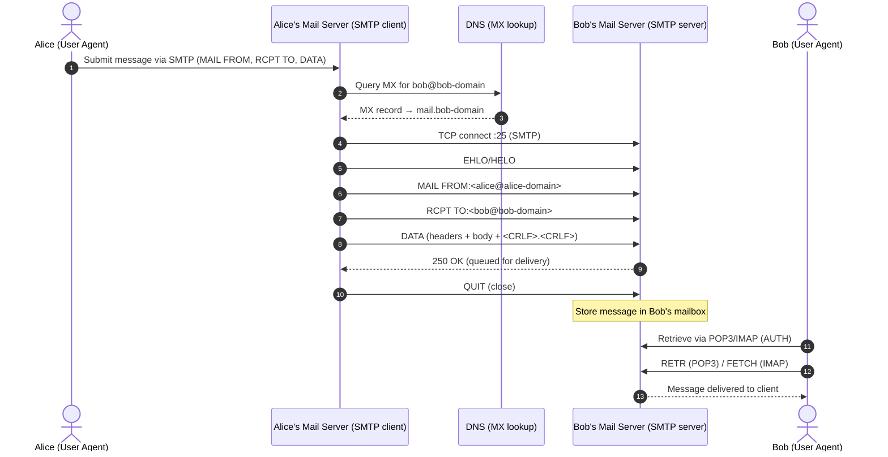

# Lecture 04: Network Applications & Demo

## Common properties of a server

- On always-on host
- Uses permanent IP address
- Uses well-known ports
- Waits to be contacted

---

## Socket

- Interface between the application layer and the transport layer.
- OS-controlled interface which application process can both send and receive messages.

---

## Internet Transport Protocols Services

### TCP

- Reliable transport
- Flow control
- Congestion control
- Does not provide timing, minimum throughput guarantee, security
- Connection oriented

### UDP

- Unreliable data transfer
- Does not provide reliability, flow control, congestion control, timing, timing, throughput guarantee, security, or connection setup

---

## SSL

- Provides encrypted TCP connection
- Data integrity
- End-point authentication
- At application layer

---

## HTTP

- Uses TCP
- Stateless (TCP maintains connection state, application layer is not maintaining the application/user state)
- Default HTTP Server Port: 80

### Message Format

**Request:**

- Request line (`Request type | URL | HTTP version`)
- Headers
- A blank line
- Body

**Response**:

- Status line (`HTTP version | Status code | Status phrase`)
- Headers
- A blank line
- Body

### Request Types

1. POST method
2. GET method
3. PUT method
4. DELETE method
5. HEAD method

### Response Status Codes

- 200 OK
- 301 Moved Permanently
- 304 Not Modified
- 400 Bad Request
- 404 Not Found
- 505 HTTP Version Not Supported

### User State Management

- HTTP server is stateless
- HTTP uses cookies to manage user identity and state
- Cookies’ components:
    1. HTTP response header
    2. HTTP request header
    3. Cookie file
    4. Back-end database

### HTTP/1.1

- First come first serve over a single TCP connection
- Can cause HOL blocking
    
    > Head-of-line (HOL) blocking is when the first item waiting in a queue can’t be served, so everything behind it is forced to wait—even if those later items could otherwise proceed.
    > 

### HTTP/2 Upgrade

- Decreased delay in multi-object HTTP requests
- Transmission order of requested objects based on client-specified object priority
- Push unrequested objects to client
- Divide objects into frames, schedule frames to mitigate HOL blocking

### HTTP/3 Upgrade

- Decreased delay in multi-object HTTP requests
- Adds security, per object error and congestion controller UDP (Uses QUIC)
    
    > Quick UDP Internet Connections (QUIC) is a UDP-Based Multiplexed and Secure Transport.
    > 

---

## E-mail Protocols (SMTP, POP, IMAP)

### Major Components

1. User Agents / Mail Readers 
    - Eudora, Outlook, elm, Mozilla Thunderbird
2. Message Transfer Agents
    - SMTP - port 25
        - Simple Mail Transfer Protocol is the **push** protocol mail servers use to relay/deliver messages between MTAs (and for client submission via an MSA)
        - Uses persistent connections
        - Requires message to be in 7-bit ASCII
        - Multiple objects sent in multipart message
3. Manage Access Agents (POP 3 - port 110 and IMAP 4 - port 143)
    - POP 3 - port 110
        - Post Office Protocol (v3) [RFC 1939] is a stateless **pull** access protocol for a user to fetch mail from their mailbox
        - Uses either “download-and-keep” or “download-and-delete”
    - IMAP 4 - port 143
        - Internet Mail Access Protocol (v3) [RFC 1730] a **pull** access protocol, but designed to **keep all mail on the server**, support **folders**, and **preserve user state**

---

## P2P Architecture

### Characteristics

- No always-on server
- Arbitrary end systems directly communicate and serve each other

### Examples

- BitTorrent (File Distribution)
- KanKan (Streaming)
- Skype (VoIP)
- Multiplayer Games
- Bitcoin (Blockchain)

### File Distribution Time

$$
D_{\text{P2P}} \ge \max \{\frac{F}{u_s}, \frac{F}{d_{\min}}, \frac{NF}{u_s + \sum u_i}\}
$$

with:

- $u_i$: Peer $i$ upload capacity.
- $d_i$: Peer $i$ download capacity.
- $F$: The file size.
- $N$: The number of Peer being sent.
- Compared to client-server
    
    $$
    D_{\text{C-S}} \ge \max \{\frac{NF}{u_s}, \frac{F}{d_{\min}}\}
    $$
    

### BitTorrent (BT) mechanism

- File divided into 256 KB chunks
- Torrent/swarm: A group of peers exchanging chunks of a file
- Tracker: Tracks peers participating in a torrent
- Churn: Peers may come and go
- Once peer has entire file, it may (selfishly) leave or (altruistically) remain in the torrent as seeder
- Requires a good Piece Selection Policies such that the file can still be circulating in the torrent even though the initial seeder is taken down prematurely
    1. **Strict Priority**
        - Not commonly used
    2. **Random First Piece**
        - Commonly used at the beginning
        - Select a random piece of the file and download it ASAP
    3. **Rarest First**
        - General rule
        - Determine the rarest piece among peers and download those first
    4. **End Game Mode**
        - Commonly used at the end
        - Missing pieces are requested from every peer containing them
- Built-in incentive mechanism (Tit-for-tat strategy)
    1. **Choking Algorithm**
        - Temporary refusal to upload to free riders
        - Sends chunks to top four peers currently sending them chunks at highest rate and re-evaluate
    2. **Optimistic Unchoking**
        - At certain time (every 30 seconds), select another peer, outside the top 4, to be “optimistically unchecked” and send chunks to him
- Upload to those with the best upload rate to ensure pieces get replicated faster and new seeders are created fast