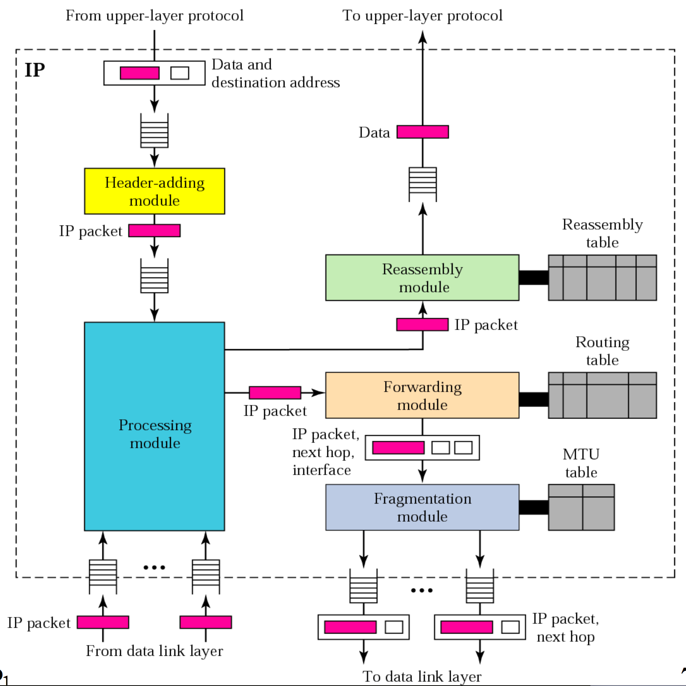

# Lecture 07: IP-Options, ICMP, NAT-Hole Punching

## IP Datagram Format

| Offset (bits) | Length (bits) | Field | What it means |
| --- | --- | --- | --- |
| 0 | 4 | Version | IP version (4 for IPv4). |
| 4 | 4 | IHL | Internet Header Length in 32-bit words (min 5 → 20 bytes). |
| 8 | 6 | DSCP | Differentiated Services Code Point (QoS marking) [Currently not supported in the internet]. |
| 14 | 2 | ECN | Explicit Congestion Notification. |
| 16 | 16 | Total Length | Entire datagram length in bytes (header + data). |
| 32 | 16 | Identification | Tag to help receivers reassemble fragments. |
| 48 | 3 | Flags | 3 bits: reserved, DF (Don’t Fragment), MF (More Fragments). |
| 51 | 13 | Fragment Offset | Position of this fragment, in 8-byte units. |
| 64 | 8 | TTL | Time To Live (hop limit), decremented by each router. |
| 72 | 8 | Protocol | Upper-layer protocol number (e.g., 1=ICMP, 6=TCP, 17=UDP). |
| 80 | 16 | Header Checksum | Internet checksum over the IPv4 header. |
| 96 | 32 | Source Address | Sender’s IPv4 address. |
| 128 | 32 | Destination Address | Receiver’s IPv4 address. |
| 160 | variable | Options + Padding | Optional fields (0–40 bytes) and padding to 32-bit boundary. |

### Options

- First Bit (Copy):
    - $0$ means Copy only in first segment
    - $1$ means Copy into all fragments
- Second and Third Bits (Class):
    - $00$ Datagram Control
    - $01$ Reserved
    - $10$ Debugging and Management
    - $11$ Reserved
- Remaining 5 bits (Number):
    - $00000$ End of option
    - $00001$ No operation
    - $00011$ Loose source route
        - `Type:137 (8 bits) | Length (8 bits) | Pointer (8 bits) | First IP Address (32 bits) | Second IP Address (32 bits) | ... | Last IP Address (32 bits)`
        - Only 9 addresses can be listed.
        - Store the packet route that must be traversed. The addresses stored can be not adjacent. The packet can traverse through another router in between.
    - $00100$ Timestamp
    - $00111$ Record route
        - `Type:7 (8 bits) | Length (8 bits) | Pointer (8 bits) | First IP Address (32 bits) | Second IP Address (32 bits) | ... | Last IP Address (32 bits)`
        - Only 9 addresses can be listed.
        - Records all the router passed by the packet.
    - $01001$ Strict source route
        - `Type:137 (8 bits) | Length (8 bits) | Pointer (8 bits) | First IP Address (32 bits) | Second IP Address (32 bits) | ... | Last IP Address (32 bits)`
        - Only 9 addresses can be listed.
        - Store the strict packet route that must be traversed consecutively / directly (every listed address must be adjacent), if not possible, drop and send ICMP fail.

---

## Segmentation

- Caused by physical limitations (MTU / Maximum Transmission Unit)
- Takes place at a **Router** or a **Original Sending Host**
- Reassembled at the **destination host**

## IP Fragmentation at IP Layer

To send a big application data, the application data need to be fragmented to `IP | UDP | Application Data` + `IP | Application Data`

## TCP Segmentation at TCP Layer

To send a big application data, the application data need to be segmented to `IP | TCP | Application Data` + `IP | TCP | Application Data`

---

## IP Components

---

## Internet Control Message Protocol (ICMP)

- ICMP is specified in RFC 792
- ICMP is an error reporting mechanism and can only report error condition back to the original source
- ICMP allows routers and hosts to send information or control messages to other routers or hosts

## ICMP Message Format

`Type (8 bits) | Code (8 bits) | Checksum (16 bits) | Rest of header | Data Section`

### ICMP Type

| Category | Type | Message |
| --- | --- | --- |
| Error-reporting messages | 3 | Destination unreachable |
| Error-reporting messages | 4 | Source quench (a datagram has been discarded due to congestion) |
| Error-reporting messages | 11 | Time exceeded |
| Error-reporting messages | 12 | Parameter problem |
| Error-reporting messages | 5 | Redirection |
| Query messages | 8 or 0 | Echo request or reply |
| Query messages | 13 or 14 | Timestamp request or reply |

### ICMP Code

| Codes | Message |
| --- | --- |
| 0 | Network unreachable |
| 1 | Host unreachable |
| 2 | Protocol unreachable |
| 3 | Port unreachable |
| 4 | Need fragmentation but DF flag is set |

Example:

1. Received Datagram: `IP header | first 8-bytes data | remaining data` 
2. ICMP Packet: `ICMP header | IP header | first 8-bytes data`
3. Sent IP Datagram: `IP header | ICMP header | IP header | first 8-bytes data`

### ICMP query messages

Format: `Type = 13 or 14 (1 byte) | Code: 0 (1 byte) | Checksum (2 bytes) | Identifier (2 bytes) | Sequence number (2 bytes) | Original timestamp | Receive timestamp | Transmit timestamp`

### ICMP echo

Format: `Type = 8 or 0 (1 byte) | Code: 0 (1 byte) | Checksum (2 bytes) | Identifier (2 bytes) | Sequence number (2 bytes) | Optional Data` 

### Further ICMP Questions

What if a datagram carrying ICMP error message causes another error?

    Routers or hosts drop the package silently instead of sending another ICMP error message to avoid infinite loop.

Do we need ICMP error message for each fragment of a fragmented datagram that causes the error?

    No, sending one ICMP per datagram is enough. No need to send one per fragment.

ICMP error messages will not be generated for a datagram having a multicast or broadcast address in the destination address field, why?

    If ICMP error is generated, many receivers will generate ICMP and reply the original packet which cause traffic.

ICMP error messages will not be generated for a datagram whose source address is not a single host, why?

    Because there is no legitimate routable unicast to send back the error message.

    

---

## Traceroute

- Sends a UDP datagram to destination with TTL field in IP header set to $1$
- Datagram: 8 bytes UDP + 20 bytes IP + 12 bytes data
- Increment TTL progressively until final destination is reached
- How to terminate?
    - UDP port chosen is a non-existence port
    - Destination sends ICMP “port unreachable” error

---

## Network Address Translation (NAT)

- Private IP addresses
- Translate between internal addresses/ports and external addresses/ports
- Each record in the translation table contains:
    - Private address
    - Private port
    - External address
    - External port
    - Transport protocol

---

## NAT Traversal Technique

### Port Forwarding

- Define mapping in advance in the NAT box without needing the local host to talks out first
- Buy a domain and insert a ‘A’ record with the IP known to the outside world

### Connection Reversal

- Let B wants to connect to A who is behind a NAT
- Two approaches:
    - Relay the request via a server (which must be connected to A)
    - Assume an existing connection between A and B and ask for a new one

### Hole Punching

- Devices A and B are behind NAT gateways
- Have an Internet-accessible **rendezvous server** S
- Host A sends a message to S
    - Which will set up a NAT translation on A’s gateway
    - S now knows the A’s external host & port
- Host B sends a message to S
    - Which will set up a NAT translation on B’s gateway
    - S now knows the B’s external host & port
- S tells A and B each other’s IP address & port

### Relay Messages

- Send / relay all messages to a third party Internet-accessible server which will act as proxy and forward the messages