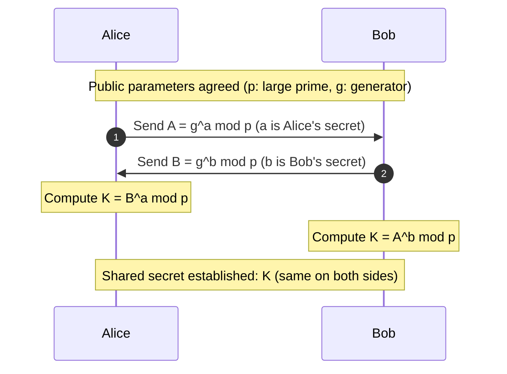
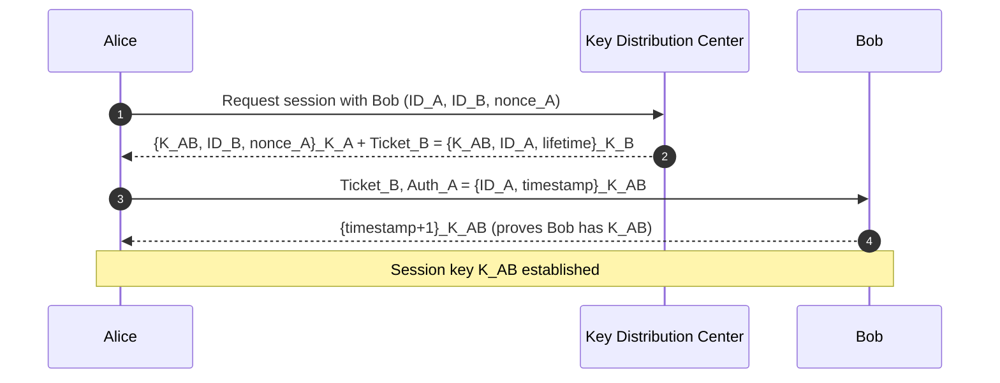
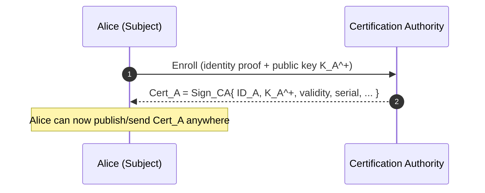
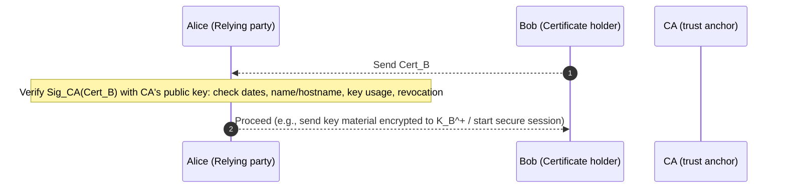

# Lecture 09: Network Security

## Symmetric Key

### Examples

- Data Encryption Standard (DES)
- Advanced Encryption Standard (AES)

### Property

1. A shared secret key can be used in Alice-Bob communication.
2. A different shared secret key is recommended in Bob-Alice communication.

## Asymmetric Key

1. Bob’s keys are used in Alice-Bob communication (Alice encrypt with Bob’s public key, Bob decrypt with Bob’s private key).
2. Alice’s keys are used in Bob-Alice communication (Bob encrypt with Alice’s public key, Alice decrypt with Alice’s private key).

## Message Integrity

### Message Digest or Modification Detection Code (MDC)

- Used by the sender to ensure the message is not altered by someone else.
- A fixed length “**fingerprint**” of a message $m$ is known as **Message Digest**, $H(m)$ is generated using a hash function.
    
    > The Hash function should be a secure hash function that is **one-way**, **collision resistant**, and **pre-image resistant**.
    > 

### Message Authentication Code (MAC)

- Used by the receiver to ensure the message is from the original sender.
- Used for symmetric key encrypted communication.
- Attach $H(\text{Message} + \text{Key})$

---

## Non Repudiation

Sender must not be able to deny sending a message that he did send.

- What if the sender changes his/her public key?
    
    Uses key history - time. Shows that the message is generated with the old certificate when it is still valid.
    

---

## Entity Authentication

User needs to be authenticated before any message communication starts.

- What if the user want to send and receive a series of secured messages in real-time? Do we need to authenticate each message separately?
    - Do one full entity authentication up front and establish a **fresh session key**.
    - **Then authenticate each message implicitly** with that session key using a **MAC/AEAD tag.**

### Protocol

1. **Protocol ap1.0**
    - Alice says “I’m Alice” and sends her secret password to “prove” it.
    - Failure Scenario:
        - Anyone on-path can learn the password and log in.
        - Nothing to prove that “Alice is present”.
2. **Protocol ap1.1**
    - Alice says “I’m Alice” and sends her **encrypted** secret password to “prove” it.
    - Failure Scenario:
        - The captured cipher text can be resend again.
        - Nothing to prove that “Alice is present”.
3. **Protocol ap4.0**
    - To prove Alice “live”, Bob sends Alice **nonce**, $R$. Alice must return $R$, encrypted with **shared secret key**.
    - Failure Scenario:
        - Weak nonce / reused nonce.
        - Shared key leak
4. **Protocol ap5.0**
    - Uses nonce and public key cryptography using asymmetric key.
    - Failure Scenario:
        - Replay if nonce is not checked
        - Key leak

---

## Key Distribution and Certification

### Symmetric Key Cryptography

- Each user send a long-term secret key to **Key Distribution Center (KDC)**.
- When Alice wants to talk to Bob, the KDC mints a fresh **session key** and securely tells each side.
- Easy to provoke.

### Public Key Cryptography

- Use a **Certification Authority (CA)** that binds entity to public key via signed certificate.
- Once certified, the public key can be fetched **from anywhere** and verified with the CA’s signature.

### Diffie Hellman - Key Exchange Protocol (without KDC)

### KDC

### Certificate Issuance by CA

### Certificate Validation

---

## Denial of Service

### Distributed Denial of Service (DDoS)

Attackers make resources (server, bandwidth) unavailable to legitimate traffic by overwhelming resource with bogus traffic.

1. Select target
2. Break into hosts around the network
3. Send packets to target from compromised hosts

---

## Network Layer Security

- Sending host encrypts data in the IP datagram.
- Destination host authenticate source IP address.

### IPsec Modes

- In the **transport mode** only protects information from the transport layer.
- In the **tunnel mode** also protects original IP header.

---

## Transport Layer Security (TLS)

- Used between web browsers, servers for e-commerce.
- Security services:
    - Confidentiality: via symmetric encryption
    - Integrity: via cryptographic hashing
    - Authentication: via public key cryptography

### A toy-TLS Handshake

1. **Phase 1: Handshake**
    - Bob establishes TCP connection to Alice
    - Authenticates Alice via CA signed certificate
    - Creates, encrypts (using Alice’s public key), sends pre-master secret key to Alice
2. **Phase 2: Key Derivation**
    - Using the Master Secret Key, generate 4 keys:
        - $E_B: \text{Bob} \rightarrow \text{Alice}$ data encryption key.
        - $E_A: \text{Alice} \rightarrow \text{Bob}$ data encryption key.
        - $M_B: \text{Bob} \rightarrow \text{Alice}$ MAC key.
        - $M_A: \text{Alice} \rightarrow \text{Bob}$ MAC key.
3. **Phase 3: Data Transfer**