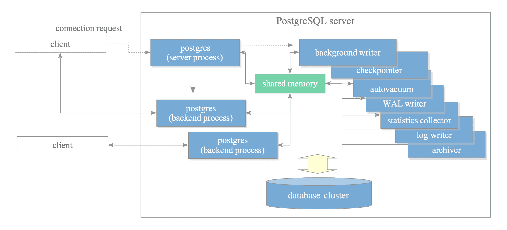

# Lecture 0: Course Introduction

# Introduction

- Study the concepts and implementation issues related to database management systems.
- The first part covers the physical implementation of relational data model:
    - Storage management
    - Access methods
    - Query processing
    - Optimization
- The second part covers issues and techniques dealing with multi-user application environments:
    - Transactions
    - Concurrency
    - Control
    - Recovery

# Prerequisites Knowledge

- Relational Data Model
- Relational Algebra
- SQL
- Knowledge in Operating System will be useful

# Timeline

| Week | Topic |
| --- | --- |
| 1 | Data Storage |
| 2 | Tree-Structure Indexing |
| 3 | Hash-based Indexing |
| 4 | External Sorting |
| 5 | Query Evaluation |
| 6 | Evaluating Relational Operators |
| 7 | Query Optimizer |
| 8 | Transaction Management |
| 9 | Concurrency Control 1 |
| 10 | Concurrency Control 2 |
| 11 | Crash Recovery |
| 12 | Review |

# Resource for Learning C

- GNU C Reference Manual: [https://www.gnu.org/software/gnu-c-manual/gnu-c-manual.html](https://www.gnu.org/software/gnu-c-manual/gnu-c-manual.html)
- K.N. King, C Programming: A Modern Approach, Norton, 1996
- B.W. Kernighan & D.N. Ritchie, The C Programming Language, 2nd edition, Prentice Hall, 1988

# Study of DBMS (Database Management System)

- Database design (covered in CS2102)
- Database programming (covered in CS2102)
- Database implementation (covered in CS3223)

# Architecture of DBMS

# Process Architecture in PostgreSQL
