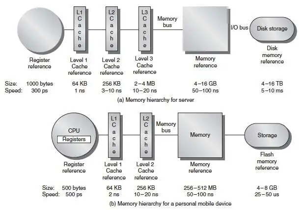
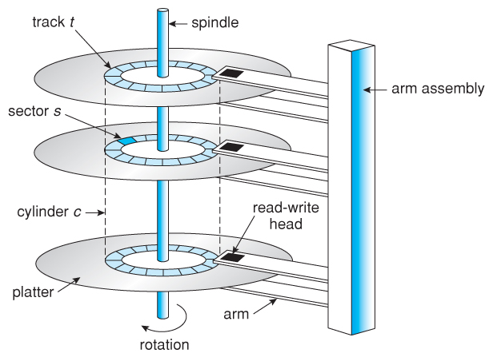
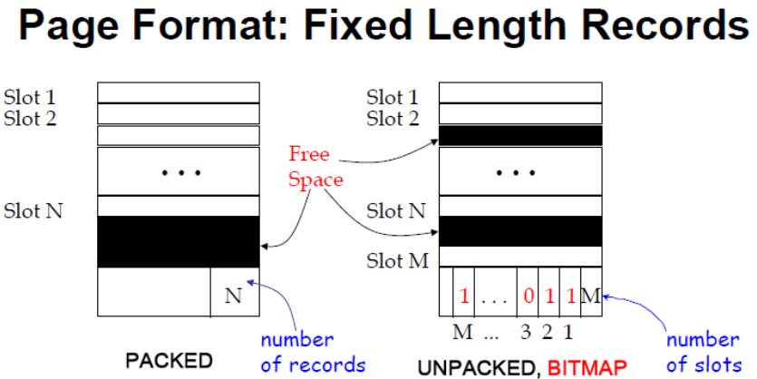
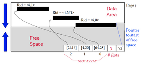
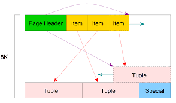

# Lecture 1: Data Storage

# What Does a DBMS Store?

- **Relations**: The tables with data.
- **System Catalog (Data Dictionary)**:
    - Stores metadata (schemas, constraints, triggers).
    - Definitions of views and indexes.
    - Statistics of query optimization.
- **Log Files**: Used for data recovery.

# Memory Hierarchy

Data storage spans multiple types of memory with trade-offs in **speed, costs and capacity**.

- **Primary Memory**
    - Registers
    - Static RAM (caches)
    - Dynamic RAM (Physical Memory)
- **Secondary Memory**
    - Magnetic Disks (HDD)
    - Solid-State Disks (SSD)
- **Tertiary Memory**
    - Optical Disks
    - Tapes

# DBMS Storage

- Data is stored on **non-volatile disks** for persistence and processed in **RAM** for speed.
- Disk operations:
    - **Read:** Transfers data from disk to RAM.
    - **Write**: Transfers data from RAM to disk.

# Storage Device

## Magnetic Hard-Disk Drive (HDD)

### Disk Access Time

#### Command Processing Time

- The time taken by the disk controller to interpret the access command.
- This is usually very small and considered negligible in most cases.

#### Seek Time

- The time it takes for the disk’s read/write arm to move the head to the correct track (cylinder) on the disk.
- **Average Seek Time**: Typically around 5–6 ms for modern HDDs.

#### Rotational Delay

- The time it takes for the desired sector of the disk to rotate under the read/write head.
- Depends on the rotational speed of the disk, measured in **rotations per minute (RPM)**.
- **Average Rotational Delay**:
    
    $\text{Average Rotational Delay} =\frac{1}{2} \times \frac{60}{\text{RPM}}$.
    

#### Transfer Time

- The time required to transfer data between the disk surface and the memory (RAM).
- It depends on:
    - The number of requested sectors (n) on the same track.
    - The time for one full disk revolution.
    - The number of sectors per track.
- Formula:
    
    $\text{Transfer Time} = n \times \frac{\text{Time for One Revolution}}{\text{Sectors per Track}}$.
    
- Typical transfer time for a sector is about 100–200 µs.

#### Queueing Delay

- The time a request spends waiting in the disk’s queue before being processed.
- This varies depending on the load on the disk.

#### Total Disk Access Time

$\text{Disk Access Time} = \text{Seek Time} + \text{Rotational Delay} + \text{Transfer Time}$.

If the queuing delay is included:

$\text{Response Time} = \text{Queuing Delay} + \text{Disk Access Time}$.

## Solid-State Drive (SSD)

- Built with NAND flash memory without any mechanical/moving parts.
- **Advantages**:
    - Random I/O: 100x faster than HDD.
    - Sequential I/O: Slightly faster than HDD.
    - Lower power consumption.
- **Disadvantages**:
    - Updating a page requires erasure of multiple pages before overwriting page (~5 ms per update).
    - Limited number of times a page can be erased.

# Storage Manager Components

Responsible for organizing and accessing data stored on disk in a DBMS. It ensures efficient, reliable, and recoverable operations between disk storage and the database. Partitioned into 3 components: File & Access Methods Layer (File Layer), Buffer Manager, and Disk Space Manager.

## File Layer

- Organizes data into files and records.
- Supports different file organizations:

## Buffer Manager

- Manages a portion of RAM as a cache for disk pages.
- Uses replacement policies (e.g., LRU, Clock) to decide which pages to evict.
- Ensures dirty pages are written back to disk before eviction.

### Buffer Pool

- Divided into frames, each storing a disk block.
- Tracks using two key variables:
    - **Pin Count**: The number of users/processes accessing the page.
    - **Dirty Flag**: Indicates if the page is modified but not written to disk.

### Page Lifecycle

- **Pinning**: Increment pin count when accessing a page.
- **Unpinning**: Decrement pin count when done.
- Pages can only be replaced if pin count is 0.
- Dirty pages must be written to disk before eviction.

### Replacement Policies

When the buffer pool is full, a replacement policy determines which unpinned page to evict:

- **Random**: Chooses a random page.
- **FIFO (First In First Out)**: Evicts the oldest page.
- **LRU (Least Recently Used)**: Evicts the least recently accessed page using a queue to keep track.
- **Clock Policy**:
    - Uses a “clock” pointer and a referenced bit to approximate LRU.
    - Store 2 variables:
        - **current**: To determine which buffer frame is currently being pointed.
        - **referenced bit**: Stored in each frame which will turns on when the pin count becomes 0.
    - Replace a page that has referenced bit off and pin count equals to 0.

## Disk Space Manager

- Allocates and deallocates pages on the disk.
- Keeps track of free/used space.

# File

## File Abstraction

- Each relation is file of records.
- Each record has a unique record identifier (**RID**).
- Common Operations: Create, Delete, Insert, Delete by RID, retrieve by RID, scan all records.

## File Organization

- **Heap file**: Unordered file
- **Sorted file**: Records are ordered on some search keys.
- **Hashed file**: Records are located in blocks via a hash function.

## Page Format

- **Fixed-Length Records**:
    - **Packed**: Records stored contiguously.
    - **Unpacked**: Bitmap indicates free slots.
    
    
    
- **Variable-Length Records**:
    - Use **slotted page organization**, with a directory for offsets to record locations.
        
        
        
    - PostgreSQL’s Slotted Page Organization
        
        
